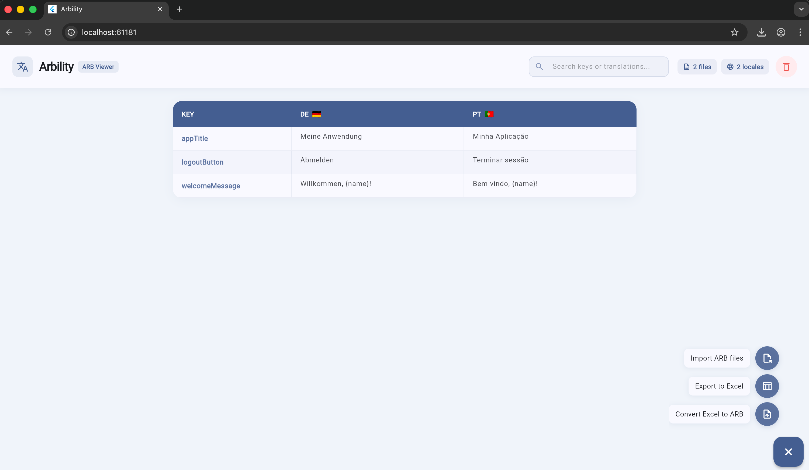

# 🌐 Arbility



A Flutter web app for viewing and editing ARB (Application Resource Bundle) translation files side by side.

Import your `.arb` files, and Arbility groups them by locale into a clean, editable table — making it easy to compare and update translations across languages.

## ✨ Features

- 📂 **Import multiple ARB files** — select one or more `.arb` files at once
- 🏳️ **Automatic locale detection** — extracts locale from filenames (e.g. `app_en.arb` → `EN 🇬🇧`, `app_DE_de.arb` → `DE_DE 🇩🇪`)
- 📊 **Unified table view** — translation keys as rows, languages as columns
- ✏️ **Inline editing** — click any translation cell to edit it directly
- 🟢 **Change tracking** — edited cells turn green; hover to see the original value
- 🔍 **Search** — search by key name or translation value with instant debounced filtering
- 🔗 **Source tracing** — hover any cell to see which file it came from
- 📑 **Pagination** — configurable page size for large translation sets
- 📤 **Excel export** — export all translations to `.xlsx` via the expandable FAB
- 📤 **Excel to Arb utility** — convert the `.xlsx` file into a set of `.arb`
- ➕ **Add new entry** — define a new translation key with values for each locale directly in the app
- 📥 **Download ARB files** — export the current table state (including edits and new entries) as a `.zip` of `.arb` files
- ⚖️ **File priority** — when duplicate keys exist across files, drag-to-reorder which file takes precedence
- ⚙️ **Configurable** — toggle file priority and set page size via `configuration.json`

## 🚀 Getting Started

### Prerequisites

- [Flutter SDK](https://docs.flutter.dev/get-started/install) (3.10+)
- Web support enabled (`flutter config --enable-web`)

### Run

```bash
flutter pub get
flutter run -d chrome
```

### Test

```bash
flutter test
```

## ⚙️ Configuration

Settings are loaded from `assets/configuration.json`:

```json
{
  "filePriority": true,
  "pageSize": 25
}
```

| Setting | Type | Default | Description |
|---------|------|---------|-------------|
| `filePriority` | `bool` | `true` | Enable file priority for duplicate key resolution |
| `pageSize` | `int` | `25` | Number of rows per page in the translation table |

## 🗂️ Project Structure

```
lib/
├── main.dart                      # App entry, theme, logging setup, Provider config
├── config/
│   ├── app_config.dart            # Configuration loader (from assets)
├── models/
│   ├── arb_document.dart          # Set of models used accross the app
├── providers/
│   └── arb_project.dart           # ArbEntry, ArbLookupResult, ArbProject data model
├── screens/
│   └── home_screen.dart           # Main screen: header, search, stats, table
├── services/
│   └── excel_export.dart          # Excel export + browser download
│   └── arb_import.dart            # Excel importer to display in the browser
│   └── excel_to_arb.dart          # Excel file to .zip of .arbs + browser download
│   └── arb_download.dart          # Export current project as .zip of .arb files
└── widgets/
    ├── arb_table.dart             # Paginated editable translation table
    ├── expandable_fab.dart        # Expandable floating action button
    ├── add_entry_dialog.dart       # Add new translation entry dialog
    ├── file_priority_dialog.dart  # Drag-to-reorder file priority dialog
    ├── import_area.dart           # File picker import zone
    └── loading_overlay.dart       # Loading widget

```

## 📦 Dependencies

| Package | Purpose |
|---------|---------|
| [`provider`](https://pub.dev/packages/provider) | State management |
| [`file_picker`](https://pub.dev/packages/file_picker) | Cross-platform file selection |
| [`excel`](https://pub.dev/packages/excel) | Excel file generation |
| [`archive`](https://pub.dev/packages/archive) | Zip file creation |
| [`web`](https://pub.dev/packages/web) | Web API access for file download |
| [`logging`](https://pub.dev/packages/logging) | Structured logging |

## 🧑‍💻 Usage

1. Click the **Import ARB files** area to select `.arb` files from your machine
2. Files are grouped by locale — each unique locale gets its own column
3. All translation keys from all files appear as rows
4. Click any translation cell to edit it — modified cells turn **green**
5. Hover a modified cell to see the **original value**; hover an unmodified cell to see the **source filename**
6. Use the 🔍 search field in the header to filter by key name or translation value
7. Click the **+** button to access actions like **Add new entry**, **Export to Excel**, or **Download ARB files**
8. If file priority is enabled, click the **files** chip in the header to reorder file precedence
9. Use the 🗑️ button in the header to clear everything and start over

## 📝 ARB File Format

Arbility expects standard ARB files — JSON with string key-value pairs:

```json
{
  "@@locale": "en",
  "greeting": "Hello",
  "farewell": "Goodbye"
}
```

Keys starting with `@` are treated as metadata and skipped.

Locale is extracted from the **filename**, not the file contents: everything after the first underscore, before `.arb`.

| Filename | Extracted Locale |
|----------|-----------------|
| `app_en.arb` | `en` |
| `app_pt_BR.arb` | `pt_BR` |
| `test_DE_de.arb` | `DE_de` |
| `messages.arb` | `messages` |
