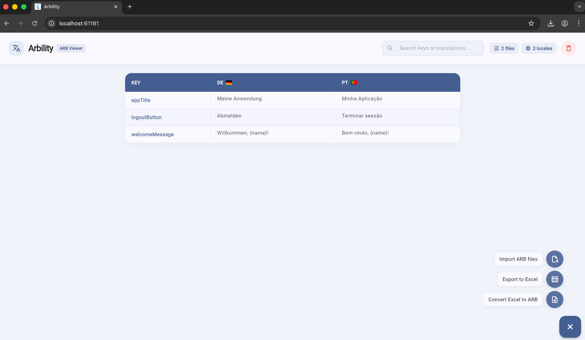

# Arbility



A Flutter web application for managing and editing translation files in multiple formats simultaneously.

Arbility supports importing ARB and `.properties` translation files, organizing them by locale into an editable table for easy comparison and updates across languages. Export to Excel with consistent column ordering, or back to `.arb` files for integration into your projects.

## Features

- **Multi-format import** — import one or more `.arb` or `.properties` files in a single operation
- **Automatic locale detection** — extracts locale from filenames (e.g., `app_en.arb` → `en`, `messages_de_DE.properties` → `de_DE`)
- **Smart locale assignment** — when a filename contains no locale or an unsupported one, a dialog prompts selection from configured supported locales
- **Locale validation** — invalid filename locales are caught and handled with user guidance
- **Fixed column layout** — Excel export always includes all configured locales in consistent order, regardless of imported files
- **Inline editing** — edit any translation cell directly in the table
- **Change tracking** — modified cells are highlighted; original values available on hover
- **Search and filter** — search by key name or translation value with instant debounced results
- **Source attribution** — hover cells to see which file a translation came from
- **Pagination** — configurable page size for managing large translation sets
- **Excel export** — choose export filename and download with all configured locale columns
- **Excel to ARB conversion** — convert Excel files back into individual `.arb` files
- **Key management** — add new translation keys with values for each configured locale
- **ARB download** — export current project state (with all edits and new entries) as a ZIP archive of `.arb` files
- **File priority** — resolve duplicate keys by drag-to-reorder file precedence
- **Full configuration** — control supported locales, file priority, and pagination via `configuration.json`

## Getting Started

### Prerequisites

- [Flutter SDK](https://docs.flutter.dev/get-started/install) (3.10+)
- Web support enabled (`flutter config --enable-web`)

### Run

```bash
flutter pub get
flutter run -d chrome
```

### Test

```bash
flutter test
```

## Configuration

Application settings are loaded from `assets/configuration.json`:

```json
{
  "filePriority": true,
  "pageSize": 25,
  "supportedLocales": [
    "de", "cs", "de-at", "de-ch", "de-lu",
    "en",
    "fr-ch", "fr-lu",
    "nl", "ro", "sk", "sv", "rs"
  ]
}
```

| Setting | Type | Default | Description |
|---------|------|---------|-------------|
| `filePriority` | `bool` | `true` | Enable file priority-based conflict resolution for duplicate keys |
| `pageSize` | `int` | `25` | Number of translation rows displayed per page |
| `supportedLocales` | `array` | `["de", "cs", "de-at", "de-ch", "de-lu", "en", "fr-ch", "fr-lu", "nl", "ro", "sk", "sv", "rs"]` | Allowed locales for import validation and Excel export column ordering |

## Project Structure

```
lib/
├── main.dart                      # App entry, theme, logging setup, Provider config
├── config/
│   ├── app_config.dart            # Configuration loader (from assets)
├── models/
│   ├── arb_document.dart          # Set of models used accross the app
├── providers/
│   └── arb_project.dart           # ArbEntry, ArbLookupResult, ArbProject data model
├── screens/
│   └── home_screen.dart           # Main screen: header, search, stats, table
├── services/
│   └── excel_export.dart          # Excel export + browser download
│   └── arb_import.dart            # Excel importer to display in the browser
│   └── excel_to_arb.dart          # Excel file to .zip of .arbs + browser download
│   └── arb_download.dart          # Export current project as .zip of .arb files
└── widgets/
    ├── arb_table.dart             # Paginated editable translation table
    ├── expandable_fab.dart        # Expandable floating action button
    ├── add_entry_dialog.dart       # Add new translation entry dialog
    ├── file_priority_dialog.dart  # Drag-to-reorder file priority dialog
    ├── import_area.dart           # File picker import zone
    └── loading_overlay.dart       # Loading widget

```

## Dependencies

| Package | Purpose |
|---------|---------|
| [`provider`](https://pub.dev/packages/provider) | Application state management |
| [`file_picker`](https://pub.dev/packages/file_picker) | Cross-platform file selection |
| [`excel`](https://pub.dev/packages/excel) | Excel spreadsheet generation and encoding |
| [`archive`](https://pub.dev/packages/archive) | ZIP archive creation and compression |
| [`web`](https://pub.dev/packages/web) | Web API bindings for browser operations |
| [`logging`](https://pub.dev/packages/logging) | Structured application logging |

## Usage

1. Open the application and click the **Import translation files** area to select `.arb` or `.properties` files
2. For files without an explicit locale in the filename (e.g., `messages.properties`, `strings.arb`):
   - A dialog will appear requesting selection of a locale from the configured supported list
3. For files with an unsupported locale in the filename (e.g., `messages_fr_CA.properties` when `fr-ca` is not configured):
   - A dialog will indicate the invalid locale and request selection of a valid alternative
4. Imported files are organized by locale, with each locale displayed as a column
5. All translation keys from imported files are displayed as table rows
6. Click any translation cell to edit its value; modified cells are visually highlighted
7. Hover over a modified cell to see the original value; hover over unmodified cells to see the source filename
8. Use the search field in the header to filter translations by key name or translation value
9. Click the action button to access:
   - **Add new entry** — create a new translation key with values for each configured locale
   - **Export to Excel** — select a filename and download a spreadsheet with all configured locale columns
   - **Download ARB files** — export current project state (including edits and new entries) as a ZIP archive
10. If file priority is enabled, click the **Files** indicator in the header to adjust file precedence
11. Click the **Clear** button to reset the application and begin with a new project

## Supported File Formats

### ARB (Application Resource Bundle)

Standard JSON format with string key-value pairs and optional metadata:

```json
{
  "@@locale": "en",
  "greeting": "Hello",
  "farewell": "Goodbye"
}
```

Keys starting with `@` are treated as metadata and skipped.

### `.properties` (Java Properties)

Key-value format with support for Unicode escapes:

```properties
# Sample translations
invoice.customer-card-number=Customer/Card no.:
invoice.tax-hint=Dient als Steuerbeleg für Ihr Finanzamt.
invoice.date=Date
```

Supports:
- Comments (lines starting with `#` or `!`)
- Key-value pairs with `=`, `:`, or whitespace separators
- Unicode escapes (e.g. `\u00fc` for `ü`)
- Escaped characters (`\n`, `\t`, `\\`, etc.)
- Line continuation with trailing backslash

### Locale Extraction

Locale is extracted from the **filename**, not the file contents: everything after the first underscore, before the file extension (`.arb` or `.properties`).

| Filename | Extracted Locale |
|----------|-----------------|
| `app_en.arb` | `en` |
| `app_pt_BR.properties` | `pt_BR` |
| `messages_de_DE.arb` | `de_DE` |
| `messages.arb` (no locale) | Prompt user to select from configured list |
| `strings_fr_CA.properties` (unsupported locale) | Prompt user to select valid locale from configured list |
